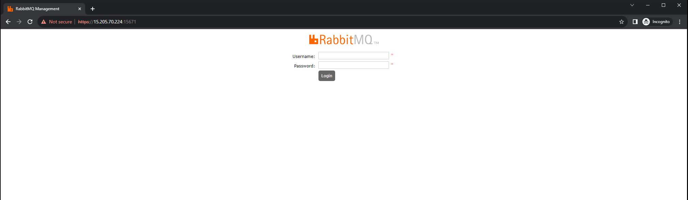
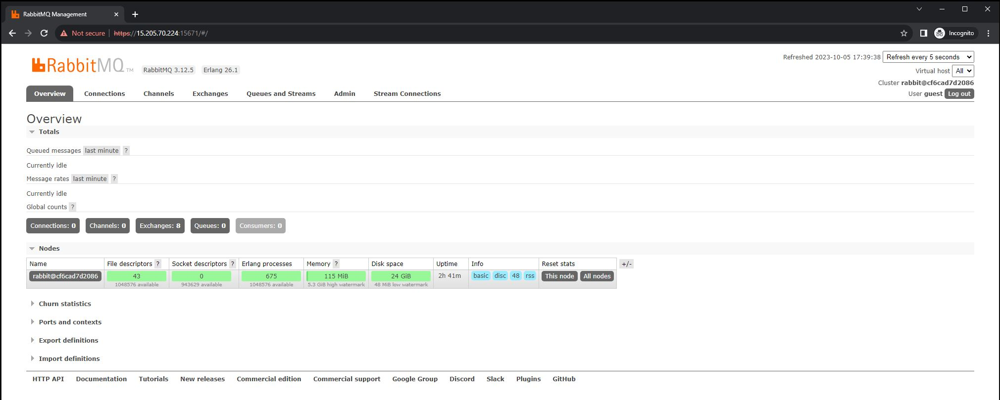

# Build base images needed to create the rabbitmq-fips:3.12.5 container image for rabbitmq 3.12.5 erlang 26.1 openssl 3.0.8
This repository contains the necessary source code files to deploy the following container images. For additional details, please email at [c.sargent-ctr@ecstech.com](mailto:c.sargent-ctr@ecstech.com).

# Images
1. ub8:1
2. rabbitmq-base:3.12.5.2
3. rabbitmq-fips:3.12.5.2

# Build ECS ub8:1 from [ironbank-repo](https://repo1.dso.mil/dsop/redhat/ubi/ubi8.git).
* Note that I used the ironbank repo but added 2 scripts.
* One is to properly enable FIPS and the second is to install RHEL repo provided maintenance/troubleshooting utilities and add time stamps to the bash history and terminal (see content under comments in Dockerfile labeled "CAS tools" for these commands.

1. ssh -i /root/ecs/alpha_key_pair.pem ec2-user@PG-TerraformPublicIP
2. sudo -i
3. /home/christopher.sargent/rabbitmq3.12.5-ubi8-fips/rabbitmq-dockerfiles/base/ubi8
4. docker build -t ub8:1 -f Dockerfile .
5. docker run -it ub8:1 /bin/bash
6. fips-mode-setup --check
```
FIPS mode is enabled.
```
# Build ECS rabbitmq-base:3.12.5.2
1. ssh -i /root/ecs/alpha_key_pair.pem ec2-user@PG-TerraformPublicIP
2. sudo -i
3. cas
4. cd /home/christopher.sargent/automation_helper_scripts/rabbitmq/rabbitmq3.11.6-ubi8-fips/rabbitmq-dockerfiles/rabbitmq-base
5. vim Dockerfile
```
FROM ub8:1

# Install dependencies
RUN dnf -y update && dnf -y install \
    openssl-devel \
    tar \
    gcc \
    perl \
    ncurses-devel \
    wget \
    procps \
    logrotate \
    unzip \
    autoconf \
    m4 \
    openssl \
    wget \
    make \
    git \
    socat \
    less

# Add OpenSSL 3.0.8
RUN yum install perl-core zlib-devel -y
WORKDIR /usr/local/src
RUN wget https://www.openssl.org/source/openssl-3.0.8.tar.gz
RUN tar -zxf openssl-3.0.8.tar.gz
WORKDIR /usr/local/src/openssl-3.0.8
RUN ./config enable-fips \
    --prefix="/opt/openssl" \
    --openssldir="/opt/openssl/etc/ssl" \
    --libdir="/opt/openssl/lib" \
    -Wl,-rpath="/opt/openssl/lib"

RUN make
RUN make install_sw install_ssldirs install_fips
RUN make install

RUN ldconfig -v
RUN mv /bin/openssl /bin/openssl.bak
RUN ln -s /opt/openssl/bin/openssl /usr/bin/
ENV OPENSSL_PATH="/usr/local/src/openssl-3.0.8"
ENV PATH=$OPENSSL_PATH:$PATH
ENV OPENSSLDIR="/opt/openssl/etc/ssl"

# Copy RedHats CA
RUN rm -rf /opt/openssl/etc/ssl/certs \
    rm -rf /opt/openssl/etc/ssl/private && \
    ln -sf /etc/ssl/certs /etc/ssl/private /opt/openssl/etc/ssl

# FIPS enabe OpenSSL
RUN openssl fipsinstall -out /opt/openssl/etc/ssl/fipsmodule.cnf -module /opt/openssl/lib/ossl-modules/fips.so
COPY openssl.cnf /opt/openssl/etc/ssl/openssl.cnf

# Verification Tasks
RUN echo $PATH
RUN which openssl
RUN openssl version -a

# Download and build Erlang 26.1 with FIPS 140-2 compliant cryptography
RUN wget https://github.com/erlang/otp/archive/OTP-26.1.tar.gz
RUN tar xvzf OTP-26.1.tar.gz
WORKDIR otp-OTP-26.1
RUN ./otp_build configure --prefix="/opt/erlang" \
    --with-ssl="/opt/openssl" \
    --enable-fips

RUN make
RUN make install

# Check that Erlang/OTP crypto & ssl were compiled against OpenSSL correctly
ENV ERLANG_INSTALL_PATH_PREFIX=/"opt/erlang"
ENV OPENSSL_INSTALL_PATH_PREFIX="/opt/openssl"
ENV PATH $ERLANG_INSTALL_PATH_PREFIX/bin:$PATH

# Download and install RabbitMQ 3.12.5
WORKDIR /
RUN wget https://github.com/rabbitmq/rabbitmq-server/releases/download/v3.12.5/rabbitmq-server-3.12.5-1.el8.noarch.rpm
RUN rpm -ivh --nodeps rabbitmq-server-3.12.5-1.el8.noarch.rpm

# Set environment variables
ENV PATH /opt/rabbitmq/sbin:$PATH

# Expose the RabbitMQ ports
EXPOSE 5672 15672

# Set the default command to run when the container starts
CMD ["rabbitmq-server"]
```
10. docker build -t rabbitmq-base:3.12.5.2 -f Dockerfile .
11. docker run -it rabbitmq-base:3.12.5.2 /bin/bash
12. fips-mode-setup --check
```
FIPS mode is enabled.
```
# Build ECS rabbitmq-fips:3.12.5.2
1. ssh -i /root/ecs/alpha_key_pair.pem ec2-user@PG-TerraformPublicIP
2. sudo -i
3. cd /home/christopher.sargent/rabbitmq3.12.5-ubi8-fips/rabbitmq-dockerfiles/rabbitmq-fips3.12.5
4. vim Dockerfile
```
# Image 
FROM rabbitmq-base:3.12.5.2
USER root

# Rabbitmq Version
ARG APP_VERSION=3.12.5

# Set ENV
ENV HOME="/var/lib/rabbitmq" \
    LANG="C.UTF-8" \
    LANGUAGE="C.UTF-8" \
    RABBITMQ_HOME="/opt/rabbitmq" \
    RABBITMQ_VERSION="${APP_VERSION}" \
    RABBITMQ_DATA_DIR="/var/lib/rabbitmq" \
    RABBITMQ_LOGS="-" \
    RABBITMQ_USER="rabbitmq" \
    RABBITMQ_GROUP="rabbitmq" \
    PATH="${RABBITMQ_HOME}/sbin:$PATH"

# Copy
COPY docker-entrypoint.sh /usr/local/bin/
COPY datetime2.sh /tmp/datetime2.sh
RUN chmod +x /tmp/datetime2.sh

# Install things
RUN set -eux \
    dnf -y upgrade && dnf -y install \
    hostname  \
    python3 \
    dos2unix \
    zlib-devel \
    perl-core && \
    dnf clean all

# Fix prompt
RUN /tmp/datetime2.sh

# Fix rabbitmqadmin
RUN dnf -y upgrade && \
    cp /usr/lib/rabbitmq/lib/rabbitmq_server-3.12.5/plugins/rabbitmq_management-3.12.5/priv/www/cli/rabbitmqadmin /usr/local/bin/rabbitmqadmin && chmod 755 /usr/local/bin/rabbitmqadmin

# Fix prompt for rabbitmq user
RUN set -eux; \
    cp /root/.bashrc /var/lib/rabbitmq; \
    chown rabbitmq:rabbitmq /var/lib/rabbitmq/.bashrc

# Set user back back as this is how the original Dockerfile was
WORKDIR ${RABBITMQ_HOME}

VOLUME ${RABBITMQ_DATA_DIR}

USER rabbitmq

# MANAGEMENT-TLS MANAGEMENT
EXPOSE 15671 15672
# PROMETHEUS-TLS PROMETHEUS
EXPOSE 15691 15692
# STREAM-TLS STREAM
EXPOSE 5551 5552
# MQTT-TLS MQTT
EXPOSE 8883 1883
# WEB-MQTT-TLS WEB-MQTT
EXPOSE 15676 15675
# STOMP-TLS STOMP
EXPOSE 61614 61613
# WEB-STOMP-TLS WEB-STOMP
EXPOSE 15673 15674
# EXAMPLES
EXPOSE 15670
# EPMD AMQP-TLS AMQP ERLANG
EXPOSE 4369 5671 5672 25672

ENTRYPOINT ["docker-entrypoint.sh"]

CMD ["rabbitmq-server"]
```
5. DOCKER_BUILDKIT=1 docker build -t rabbitmq-fips:3.12.5.2 -f Dockerfile .
6. docker run -it -u:0 rabbitmq-fips:3.12.5.2 /bin/bash
7. rabbitmqadmin --version
```
rabbitmqadmin 3.12.5
```
8. erl -eval '{ok, Version} = file:read_file(filename:join([code:root_dir(), "releases", erlang:system_info(otp_release), "OTP_VERSION"])), io:fwrite(Version), halt().' -noshell
```
26.1
```
9. openssl version -a
```
OpenSSL 3.0.8 7 Feb 2023 (Library: OpenSSL 3.0.8 7 Feb 2023)
built on: Fri Oct  6 14:02:53 2023 UTC
platform: linux-x86_64
options:  bn(64,64)
compiler: gcc -fPIC -pthread -m64 -Wa,--noexecstack -Wall -O3 -DOPENSSL_USE_NODELETE -DL_ENDIAN -DOPENSSL_PIC -DOPENSSL_BUILDING_OPENSSL -DNDEBUG
OPENSSLDIR: "/opt/openssl/etc/ssl"
ENGINESDIR: "/opt/openssl/lib/engines-3"
MODULESDIR: "/opt/openssl/lib/ossl-modules"
Seeding source: os-specific
CPUINFO: OPENSSL_ia32cap=0xfffa3203578bffff:0x7a9
```
10. fips-mode-setup --check
```
FIPS mode is enabled.
```
# Test Deploy 3.12.5.26.1.3.0.8 via rabbitmq-fips:3.12.5.2 image and test FIPS
1. ssh -i /root/ecs/alpha_key_pair.pem ec2-user@PG-TerraformPublicIP
2. sudo -i
3. /home/christopher.sargent/rabbitmq3.12.5-ubi8-fips/deploy/rabbitmq-config
4. docker run --name rabbitmq-fips3.12.5-6.0 -d -p 15671:15671 -p 5671:5671 --network rabbitmq_go_net --restart always rabbitmq-fips:3.12.5.2
5. ./prep-rabbit.sh 
6. docker exec -u:0 rabbitmq-fips3.12.5-6.0 rabbitmqctl eval 'crypto:info_fips().'
```
not_enabled
```
7. git clone --depth 1 https://github.com/drwetter/testssl.sh.git && mv testssl.sh testssl && cd testssl
8. mkdir tests
9. ./testssl.sh --log 10.200.135.10:15671 
10. mv 10.200.135.10_p15671-20231006-1529.log tests/prefipsenabled-testssl-test.log
11. https://PG-TerraformPublicIP:15671 
* Verify site is up



12. https://PG-TerraformPublicIP:15671 > login



# Enable FIPS and retest
1. docker exec -u:0 rabbitmq-fips3.12.5-6.0 rabbitmqctl eval 'crypto:enable_fips_mode(true).'
```
true
```
2. docker exec -u:0 rabbitmq-fips3.12.5-6.0 rabbitmqctl eval 'crypto:info_fips().'
```
enabled
```
3. ./testssl.sh --log 10.200.135.10:15671
4. mv 10.200.135.10_p15671-20231006-1532.log tests/postfipsenabled-testssl-test.log
5. docker exec -it -u:0 rabbitmq-fips3.12.5-6.0 /bin/bash
5. openssl version -a
```
OpenSSL 3.0.8 7 Feb 2023 (Library: OpenSSL 3.0.8 7 Feb 2023)
built on: Fri Oct  6 14:02:53 2023 UTC
platform: linux-x86_64
options:  bn(64,64)
compiler: gcc -fPIC -pthread -m64 -Wa,--noexecstack -Wall -O3 -DOPENSSL_USE_NODELETE -DL_ENDIAN -DOPENSSL_PIC -DOPENSSL_BUILDING_OPENSSL -DNDEBUG
OPENSSLDIR: "/opt/openssl/etc/ssl"
ENGINESDIR: "/opt/openssl/lib/engines-3"
MODULESDIR: "/opt/openssl/lib/ossl-modules"
Seeding source: os-specific
CPUINFO: OPENSSL_ia32cap=0xfffa3203578bffff:0x7a9
```
6. fips-mode-setup --check
```
FIPS mode is enabled.
```
7. rabbitmqadmin --version
```
rabbitmqadmin 3.12.5
```
8. erl -eval '{ok, Version} = file:read_file(filename:join([code:root_dir(), "releases", erlang:system_info(otp_release), "OTP_VERSION"])), io:fwrite(Version), halt().' -noshell
```
26.1
```
9. rabbitmqctl eval 'crypto:info_fips().'
```
enabled 
```
10. rabbitmqctl eval 'crypto:info_lib().'
```
[{<<"OpenSSL">>,805306496,<<"OpenSSL 3.0.8 7 Feb 2023">>}]
```
12. https://PG-TerraformPublicIP:15671 
* Verify site is up


12. https://PG-TerraformPublicIP:15671 > login


# Tag and push to PG ECR
1. ssh -i /root/ecs/alpha_key_pair.pem ec2-user@PG-TerraformPublicIP
2. sudo -i
3. su - jdonaldson
4. aws ecr get-login-password --region us-gov-west-1 | docker login --username AWS --password-stdin 036436800059.dkr.ecr.us-gov-west-1.amazonaws.com
5. docker tag rabbitmq-fips:3.12.5.2 036436800059.dkr.ecr.us-gov-west-1.amazonaws.com/rabbitmq-fips:3.12.5.26.1.3.0.8
6. docker push 036436800059.dkr.ecr.us-gov-west-1.amazonaws.com/rabbitmq-fips:3.12.5.26.1.3.0.8
7. https://us-gov-west-1.console.amazonaws-us-gov.com/ecr/repositories/rabbitmq-fips?region=us-gov-west-1
* Verify

# S3 Fuse PG-Terraform
* Created s3fs#s3fusedocker S3 Bucket in Playground
1. ssh -i /root/ecs/alpha_key_pair.pem ec2-user@PG-TerraformPublicIP
2. sudo -i
3. yum install automake fuse fuse-devel gcc-c++ git libcurl-devel libxml2-devel make openssl-devel hdparm -y
4. cd /root
5. git clone https://github.com/s3fs-fuse/s3fs-fuse.git
6. cd s3fs-fuse
7. ./autogen.sh
8. ./configure --prefix=/usr --with-openssl
9. make
10. make install
11. which s3fs
```
/bin/s3fs
```
12. echo 'AWS_ACCESS_KEY_ID:AWS_SECRET_ACCESS_KEY' >> /etc/passwd-s3fs && chmod 640 /etc/passwd-s3fs #Note this terraform_service_user account and is stored in Secrets Manger
13. mkdir /mnt/s3
14. s3fs s3fusedocker /mnt/s3 -o passwd_file=/etc/passwd-s3fs -o url=https://s3-us-gov-west-1.amazonaws.com
15. ll /mnt/s3/images
```
total 2577816
-rw-------. 1 root root 2639683072 Jul 10 15:59 rabbitmq-fips:3.11.6.25.2.3.0.9.tar
```
16. umount /mnt/s3
17.cp /etc/fstab /etc/fstab.07102023 && echo 's3fs#s3fusedocker /mnt/s3 fuse allow_other,_netdev,nosuid,nodev,url=https://s3-us-gov-west-1.amazonaws.com 0 0' >> /etc/fstab

18. mount -av
```
/                        : ignored
/var                     : already mounted
/var/log/audit           : already mounted
/tmp                     : already mounted
/home                    : already mounted
/dev/shm                 : already mounted
/mnt/s3                  : successfully mounted
```
19. ll /mnt/s3/images/
```
total 2577816
-rw-------. 1 root root 2639683072 Jul 10 15:59 rabbitmq-fips:3.11.6.25.2.3.0.9.tar
```
# Docker save rabbitmq-fips:3.12.5.26.1.3.0.8
1. ssh -i /root/ecs/alpha_key_pair.pem ec2-user@PG-TerraformPublicIP
2. sudo -i
3. docker save -o /mnt/s3/images/rabbitmq-fips:3.12.5.26.1.3.0.8.tar 036436800059.dkr.ecr.us-gov-west-1.amazonaws.com/rabbitmq-fips:3.12.5.26.1.3.0.8
4. ll /mnt/s3/images
```
total 20220503
-rw-------. 1 root root 2908504064 Jul 11 14:34 rabbitmq-fips3.11.6-6.0_agency07102023.tar
-rw-------. 1 root root 2908488192 Jul 11 13:51 rabbitmq-fips3.11.6-6.0_central07102023.tar
-rw-------. 1 root root 2908503552 Jul 11 14:53 rabbitmq-fips3.11.6-6.0_federal07102023.tar
-rw-------. 1 root root 2656096256 Sep 13 17:41 rabbitmq-fips:3.11.6.25.2.2.3.0.9.tar
-rw-------. 1 root root 2639683072 Jul 10 15:59 rabbitmq-fips:3.11.6.25.2.3.0.9.tar
-rw-------. 1 root root 1984743936 Oct  6 13:48 rabbitmq-fips:3.12.5.26.1.3.0.11.tar
-rw-------. 1 root root 1979581440 Oct  6 15:37 rabbitmq-fips:3.12.5.26.1.3.0.8.tar
-rw-------. 1 root root 2062849536 Oct  5 21:50 rabbitmq-fips:3.12.5.26.1.3.1.1.tar
-rw-------. 1 root root  657345024 Sep 20 19:19 rabbitmq-fips:3.9.10.23.2.1.1.0.2.tar
```

